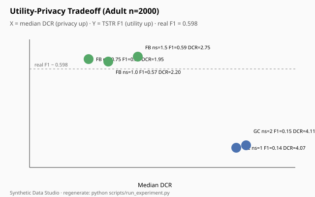
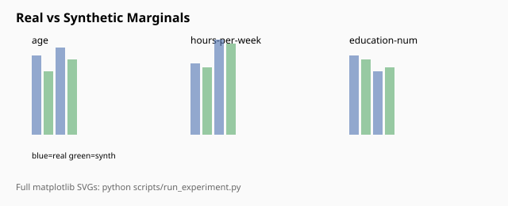
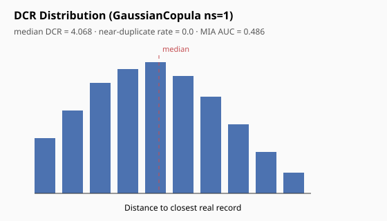
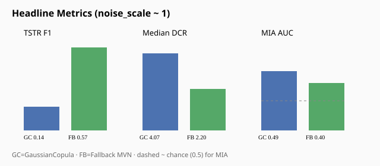
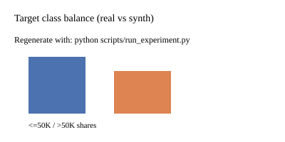

# Synthetic Data Studio

**Privacy-aware synthetic tabular data** with measurable ML utility and privacy-risk proxies.

Generate Adult/Census Income lookalikes, train classifiers **Train-on-Synthetic-Test-on-Real (TSTR)**, and quantify leakage with **Distance-to-Closest-Record (DCR)** and a simple **membership inference** attack. A Streamlit dashboard compares real vs synthetic distributions and plots the utility–privacy tradeoff.

> ⚠️ **Synthetic ≠ anonymous.** The metrics in this lab are *proxies*, not differential privacy or a legal anonymization guarantee. Do not release synth derived from regulated PII without a proper privacy review.

---

## Highlights

| Capability | Implementation |
|---|---|
| Generators | **SDV GaussianCopula** (primary), optional **CTGAN**, plus a documented **Histogram+MVN fallback** |
| Utility | Logistic regression TSTR — accuracy / F1 / ROC-AUC on a real holdout |
| Privacy proxies | Median DCR, near-duplicate rate, membership-inference AUC |
| Tradeoff | Sweep `noise_scale` across generators → SVG tradeoff plot |
| UI | Streamlit: live generate, distribution overlays, cached experiment metrics |

---

## Quickstart

```bash
python -m venv .venv
source .venv/bin/activate   # Windows: .venv\Scripts\activate
pip install -r requirements.txt

# Download Adult (OpenML) + write tiny sample
python scripts/download_data.py

# Run full utility/privacy sweep (writes reports/ + figures/)
python scripts/run_experiment.py --max-rows 2000

# Dashboard
streamlit run app/streamlit_app.py
```

Optional slower CTGAN sweep:

```bash
python scripts/run_experiment.py --max-rows 2000 --ctgan
```

---

## Dataset

- **Adult / Census Income** via `sklearn.datasets.fetch_openml("adult", version=2)` (UCI mirror fallback).
- Scripts download the full CSV to `data/raw/adult.csv`.
- A **200-row sample** is committed at `data/raw/adult_sample.csv` for offline demos.
- Experiments default to a stratified subsample (e.g. 2,000 rows) for fast portfolio runs.

---

## Generators

### 1. SDV GaussianCopula (preferred)
Fits marginals + a Gaussian copula for dependence (`sdv.single_table.GaussianCopulaSynthesizer`). A `noise_scale > 1` knob adds mild isotropic noise to numeric columns after sampling (privacy ↔ utility dial).

### 2. SDV CTGAN (optional)
GAN-based synthesizer; slower, enabled with `--ctgan`.

### 3. Fallback — `FallbackHistogramMVN` (`src/generators.py`)
Used automatically if SDV is missing, or selected as `method="fallback"`:

1. Label-encode categoricals + target  
2. `IterativeImputer` for robustness  
3. Fit a **multivariate normal** on standardized features (covariance scaled by `noise_scale`)  
4. Sample; map discrete columns via a mix of MVN rounding and **empirical histogram** draws  
5. Clip numerics to train quantiles  

This keeps the lab reproducible without heavy deps.

---

## Metrics (from a real run)

Experiment config: Adult subsample **n=2,000** → train **1,500** / holdout **500**; synth size = train size; probe = balanced **LogisticRegression**; seed **42**.

### Baseline (train on real → test on real holdout)

| Metric | Value |
|---|---|
| Accuracy | **0.804** |
| F1 | **0.598** |
| ROC-AUC | **0.841** |

### Generator sweep (excerpt)

| Method | noise | TSTR F1 | TSTR AUC | Median DCR ↑ | MIA AUC (~0.5 better) |
|---|---:|---:|---:|---:|---:|
| GaussianCopula | 1.00 | 0.144 | **0.809** | **4.068** | **0.486** |
| GaussianCopula | 1.50 | 0.155 | 0.809 | 4.076 | 0.488 |
| GaussianCopula | 2.00 | 0.155 | 0.808 | 4.106 | 0.490 |
| Fallback MVN | 0.75 | **0.579** | 0.821 | 1.951 | 0.424 |
| Fallback MVN | 1.00 | 0.570 | 0.835 | 2.197 | 0.399 |
| Fallback MVN | 1.50 | **0.588** | **0.838** | 2.748 | 0.433 |

**Takeaway:** GaussianCopula preserves **ranking utility** (AUC ≈ 96% of real) with **higher DCR** (harder nearest-neighbor copies) and MIA AUC near chance. The fallback recovers **F1 close to real** but sits closer to the training manifold (lower DCR) — a classic utility–privacy tradeoff.

Full tables: [`reports/metrics.csv`](reports/metrics.csv), [`reports/metrics.json`](reports/metrics.json).

---

## Figures











---

## Project layout

```
synthetic-data-studio/
├── app/streamlit_app.py       # Dashboard
├── src/
│   ├── data.py                # Download / load / encode Adult
│   ├── generators.py          # SDV + FallbackHistogramMVN
│   ├── utility.py             # TSTR metrics
│   ├── privacy.py             # DCR + membership inference
│   ├── evaluate.py            # Sweep orchestration
│   └── plotting.py            # SVG figures
├── scripts/
│   ├── download_data.py
│   └── run_experiment.py
├── data/raw/adult_sample.csv  # Tiny committed sample
├── figures/                   # SVG outputs
├── reports/                   # metrics.csv / metrics.json
└── outputs/                   # synthetic previews
```

---

## Privacy caveats (please read)

1. **Not DP.** DCR and MIA AUC are heuristic risk *indicators*. They do not bound adversary advantage the way ε-differential privacy does.
2. **Near-duplicates & rares.** Low DCR tails and rare categorical combos can still re-identify.
3. **Attack model matters.** Our MIA uses distance-to-synth as a score — stronger attacks (shadow models, calibrated likelihood) may do better.
4. **Dataset-specific.** Numbers above are for this Adult subsample and probe model only.
5. **Governance.** Treat synthetic extracts of sensitive sources as potentially identifying until a formal review says otherwise.

---

## License

MIT — portfolio / educational lab. Adult data retains its original UCI/OpenML terms.
